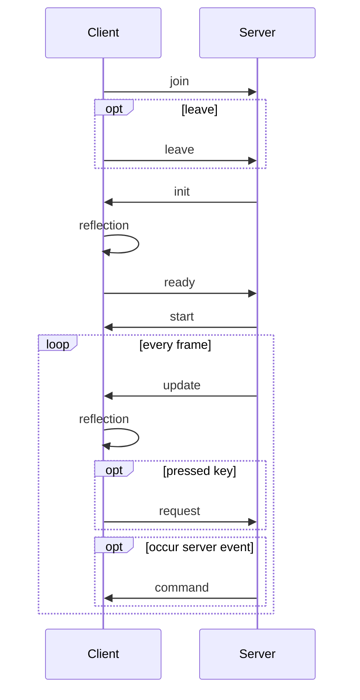

---
`join`
```json
{
  "type": "join",
  "user": "<access-token>"
}
```
`leave`
```json
{
  "type": "leave"
}
```
---
`init`
```json
{
  "type": "init",
  "objects": [
    {
      "id": 0,
      "type": "ball",
      "transform": {
        "type": "sphere",
        "position": {"x": 0, "y": 0, "z": 0},
        "rotation": {"x": 0, "y": 0, "z": 0},
        "scale": {"x": 1, "y": 1, "z": 1}
      }
    },
    {
      "id": 1,
      "type": "player",
      "transform": {
        "type": "box",
        "position": {"x": 0, "y": 0, "z": 0},
        "rotation": {"x": 0, "y": 0, "z": 0},
        "scale": {"x": 1, "y": 1, "z": 1}
      },
      "data": {
        "user_id": 0
      }
    },
    {
      "id": 2,
      "type": "player",
      "transform": {
        "type": "box",
        "position": {"x": 0, "y": 0, "z": 0},
        "rotation": {"x": 0, "y": 0, "z": 0},
        "scale": {"x": 1, "y": 1, "z": 1}
      },
      "data": {
        "user_id": 1
      }
    },
    {
      "id": 3,
      "type": "map",
      "transform": {
        "type": "box",
        "position": {"x": 0, "y": 0, "z": 0},
        "rotation": {"x": 0, "y": 0, "z": 0},
        "scale": {"x": 1, "y": 1, "z": 1}
      }
    }
  ],
  "users": [
    {"id": 0, "intra_id": "me"},
    {"id": 1, "intra_id": "opponent"}
  ]
}
```
---
`ready`
```json
{
  "type": "ready"
}
```
---
`start`
```json
{
  "type": "start",
}
```
---
`update`
```json
{
  "type": "update",
  "add": [
    {
      "id": 4,
      "type": "ball",
      "method": "immediately",
      "transform": {
        "type": "sphere",
        "position": {"x": 0, "y": 0, "z": 0},
        "rotation": {"x": 0, "y": 0, "z": 0},
        "scale": {"x": 1, "y": 1, "z": 1}
      },
      "acc": {
        "position": [
          {"x": 0, "y": 0, "z": 0},
          {"x": 0, "y": 0, "z": 0}
        ]
      }
    },
  ],
  "changed": [
    {
      "id": 0,
      "transform": {
        "position": {"x": 0, "y": 0, "z": 0}
      },
      "acc": {
        "position": [
          {"x": 0, "y": 0, "z": 0},
          {"x": 0, "y": 0, "z": 0}
        ]
      }
    }
  ],
  "delete": [
    {"id": 4, "method": "immediately"}
  ]
}
```
---
`request`
```json
{
  "type": "request",
  "command": {
    "move": {
      "right": true,
      "left": true
    }
  }
}
```
---
`command`
```json
{
  "type": "command",
  "command": {
    "gameover": {
      "result": [
        {"user_id": 0, "score": 100},
        {"user_id": 0, "score": -100},
      ]
    }
  }
}
```